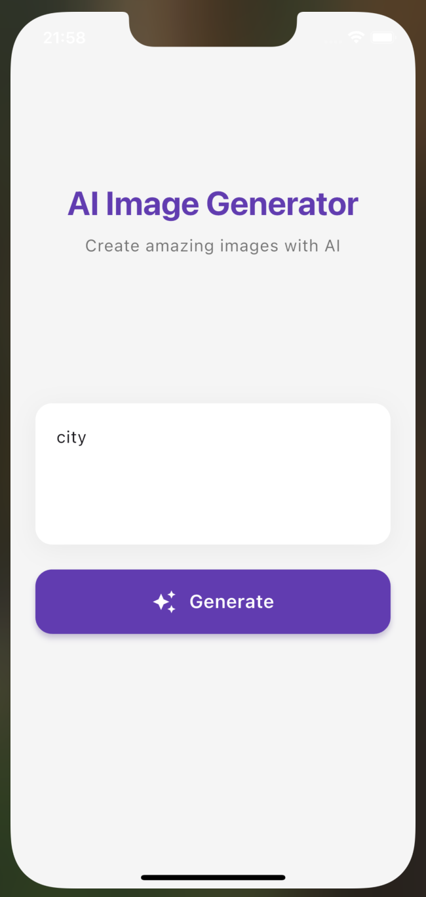
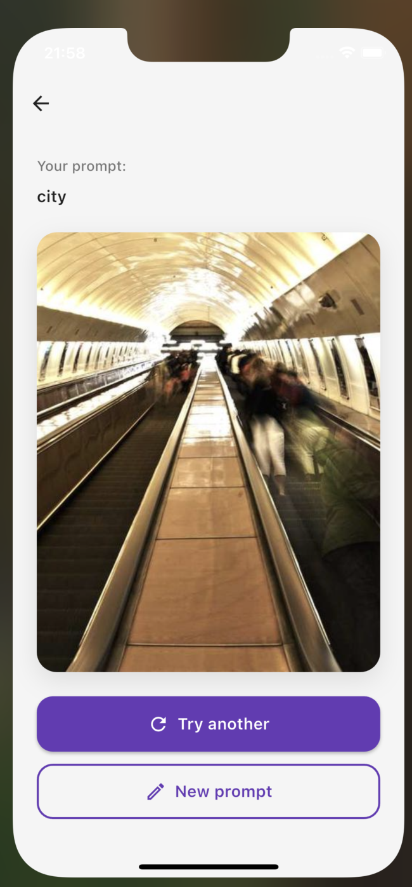
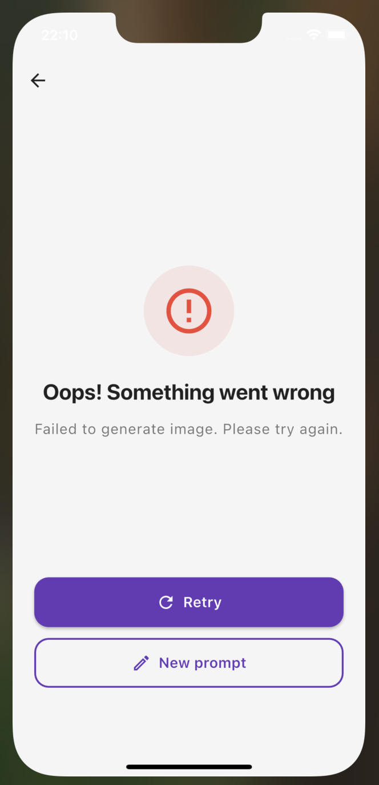

# AI Image Generator

A Flutter application that demonstrates AI image generation with a modern, clean UI and state management using flutter_bloc.

## 🎥 Demo Video

**Watch the app in action (30 seconds):**

https://github.com/Abdulazizbek2/ai_image_generator/raw/main/demo.mov

The demo video shows:

1. ✅ Prompt input and image generation (loader → image)
2. ✅ "Try another" button functionality  
3. ✅ Error handling with retry mechanism
4. ✅ "New prompt" with text preservation

> **Note**: Download `demo.mov` from the repository to watch the full demonstration.

## 📱 Screenshots

<div align="center">

### Prompt Screen


*Enter your description to generate an image*

### Result Screen


*View your generated image with options to try another or create a new prompt*

### Error Handling


*Graceful error handling with retry functionality*

</div>

## ✨ Features

- 🎨 Modern and clean user interface
- 📝 Prompt input screen with real-time validation
- 🔄 Image generation with loading states (2-3 seconds)
- ❌ Error handling with retry functionality (~50% error rate)
- 💾 Prompt preservation when navigating back
- ✨ Smooth animations and transitions
- 🎯 BLoC pattern for state management

## 🚀 Quick Start

```bash
# 1. Clone the repository
git clone git@github.com:Abdulazizbek2/ai_image_generator.git
cd ai_image_generator

# 2. Install dependencies
flutter pub get

# 3. Run the app
flutter run -d ios
# or
flutter run -d android
```

## Architecture

The app follows a feature-based architecture with clear separation of concerns:

```
lib/
├── core/
│   └── navigation/
│       └── app_router.dart          # GoRouter configuration
├── features/
│   └── image_generation/
│       ├── data/
│       │   └── mock_api_service.dart  # Mock API with ~50% error rate
│       └── presentation/
│           ├── bloc/
│           │   ├── image_generation_bloc.dart
│           │   ├── image_generation_event.dart
│           │   └── image_generation_state.dart
│           └── screens/
│               ├── prompt_screen.dart   # Screen 1: Input prompt
│               └── result_screen.dart   # Screen 2: Display result
└── main.dart
```

## Technical Stack

- **Flutter**: 3.7.2+
- **State Management**: flutter_bloc (^8.1.3)
- **Navigation**: go_router (^14.6.2)
- **Immutability**: equatable (^2.0.5)

## Getting Started

### Prerequisites

- Flutter SDK 3.7.2 or higher
- Dart SDK
- iOS Simulator / Android Emulator / Physical device

### Installation

1. Clone the repository:
```bash
git clone <repository-url>
cd ai_chat
```

2. Install dependencies:
```bash
flutter pub get
```

3. Run the app:
```bash
flutter run
```

### Running on specific platforms

iOS:
```bash
flutter run -d ios
```

Android:
```bash
flutter run -d android
```

Web:
```bash
flutter run -d chrome
```

## How It Works

### Mock API Service

The app simulates an AI image generation API with the following characteristics:

- **Delay**: 2-3 seconds per request
- **Success Rate**: ~50% (randomly generates success or failure)
- **On Success**: Returns a random placeholder image URL from picsum.photos
- **On Failure**: Throws an exception with error message

### User Flow

1. **Prompt Screen**: 
   - User enters a description
   - "Generate" button activates when text is not empty
   - Tapping generates navigates to Result screen

2. **Result Screen - Loading**:
   - Shows loading indicator during generation
   - Displays "Generating your image..." message

3. **Result Screen - Success**:
   - Displays the generated image
   - "Try another" button: Regenerates with same prompt
   - "New prompt" button: Returns to Prompt screen with saved text

4. **Result Screen - Error**:
   - Shows error message
   - "Retry" button: Attempts generation again
   - "New prompt" button: Returns to Prompt screen

## State Management

The app uses BLoC pattern with the following states:

- `ImageGenerationInitial`: Initial state with optional saved prompt
- `ImageGenerationLoading`: Generation in progress
- `ImageGenerationSuccess`: Image generated successfully
- `ImageGenerationError`: Generation failed

Events:
- `GenerateImageEvent`: Start new generation
- `RegenerateImageEvent`: Retry with same prompt
- `ResetGenerationEvent`: Return to initial state

## Design Decisions

1. **Clean Architecture**: Feature-based folder structure for scalability
2. **BLoC Pattern**: Predictable state management with clear separation
3. **Material Design 3**: Modern UI with proper elevation and theming
4. **Error-First Approach**: Comprehensive error handling at all levels
5. **User Experience**: Preserved prompts, smooth transitions, and clear feedback

## Testing

Run tests:
```bash
flutter test
```

## Future Enhancements

- [ ] Add image saving functionality
- [ ] Implement prompt history
- [ ] Add more customization options
- [ ] Integrate with real AI image generation API
- [ ] Add image editing features
- [ ] Support for multiple image styles

## License

This project is created as a test assignment.

# ai_image_generator
